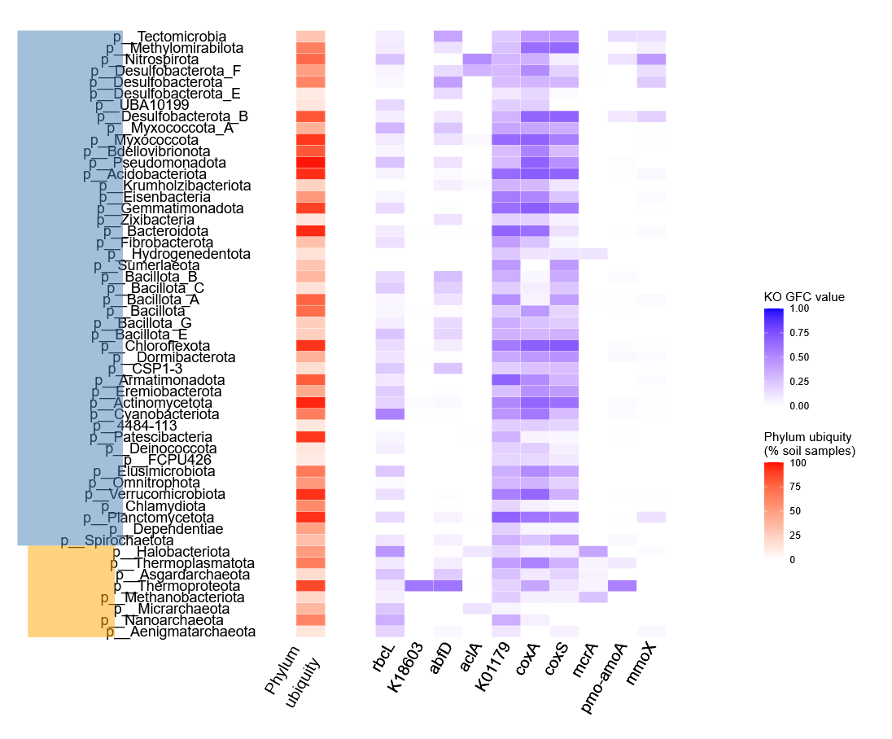

# ubiquitous_gene_content

Code developed for exploring the gene content of ubiquitous soil prokaryotic species



- ```gene_coverage_specificity.py``` > script for calculating gene coverage lineage. Input files are GTDB taxonomy per genome & eggnog-mapper gene functional annotations. Genes are formated as ```genome@gene```
- ```calculate_GFC.r``` > script for calculating Global Functional Conservation index across taxa
- ```statistics.r``` > script used for performing the statistical analysis of the paper
